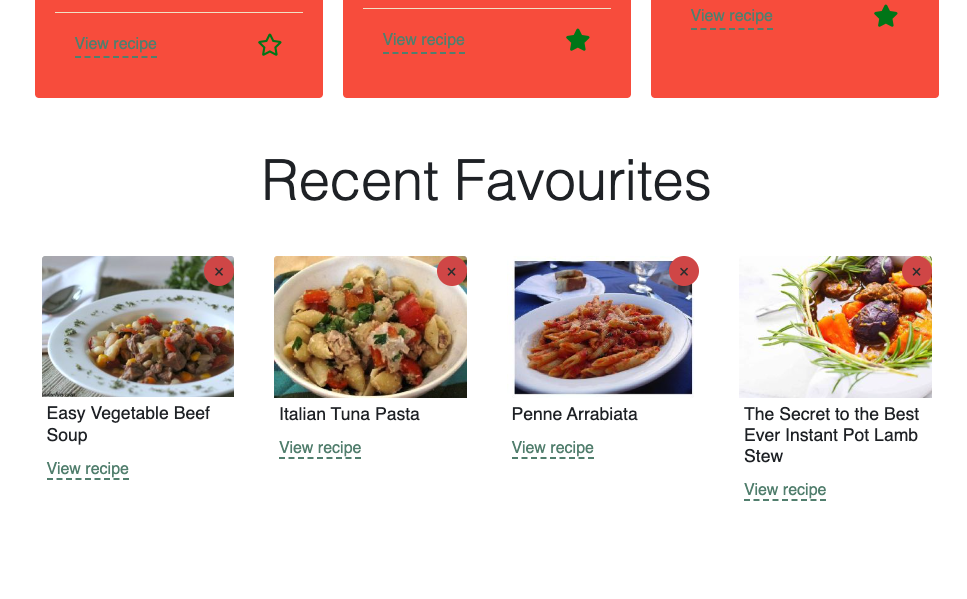

# Cooking App

   

## Description

Welcome to our cooking inspiration app! With this app, you can quickly find the recipe for you based on the food ingredients you have to hand!

## Getting Started

To access the app, navigate to the link below in a browser:

https://ateki.github.io/CookingRepo/

### Quote feature

Be inspired by amazing food quotes!

### Searching for recipes feature

Get great recipes that uses the food items you have!

### Sign-up feature

Boost your search by signing up!

### Recent favourites

Keep track of your favourite recipes!

### We love your feedback!

## Credits

- [Spoonacular](https://spoonacular.com/food-api/docs#Search-Recipes-Complex)
- [Quotes API](https://api-ninjas.com/api/quotes)
